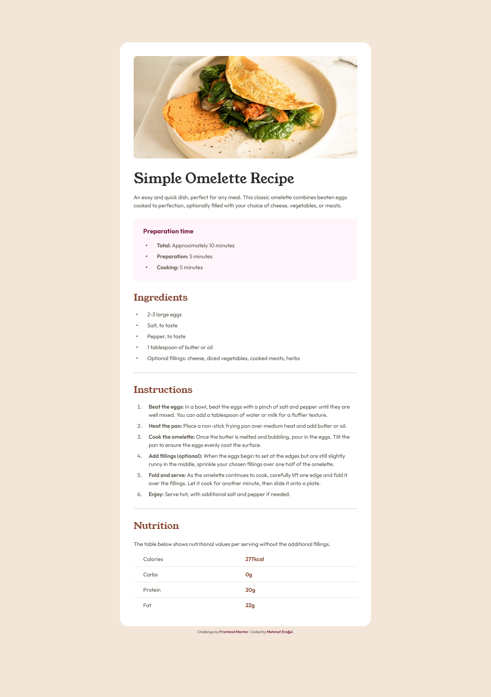
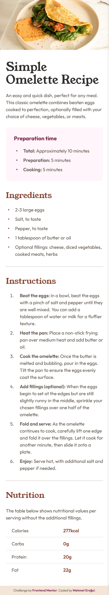

# Frontend Mentor - Recipe page solution

This is a solution to the [Recipe page challenge on Frontend Mentor](https://www.frontendmentor.io/challenges/recipe-page-KiTsR8QQKm). Frontend Mentor challenges help you improve your coding skills by building realistic projects.

## Table of contents

- [Overview](#overview)
  - [Screenshots](#screenshots)
  - [Links](#links)
- [My process](#my-process)
- [Author](#author)

## Overview

### Screenshots

### Links

- Live Site URL: [Github Pages](https://mehmeterogul.github.io/recipe-page/)

## My process

### Built with

- CSS custom properties
- Flexbox

## Author

- Github - [@mehmeterogul](https://www.github.com/mehmeterogul)
- Frontend Mentor - [@mehmeterogul](https://www.frontendmentor.io/profile/mehmeterogul)
- Twitter - [@MehmetErogul96](https://www.twitter.com/MehmetErogul96)
